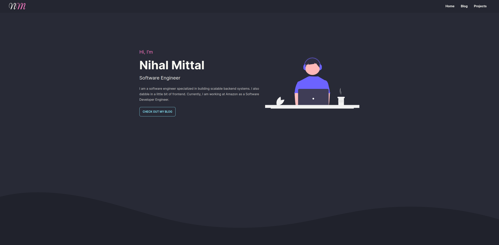

## [nihalmittal.me](https://nihalmittal.me)

[]()
[](https://nextjs.org/)

This is a Next.js based minimalist **developer portfolio** along with a **blogging** platform powered by **Netlify CMS**.



[](https://app.netlify.com/start/deploy?repository=https://github.com/codescientist703/portfolio-blog)

## Features

- :rocket: Sleek theme for a seamless experience.
- :nerd_face: Specially tailored for developers with essential pages like blog posts and projects.
- :computer: Integrated blogging platform using Netlify CMS, an open-source static site generator with traditional CMS features..
- :mag_right: SEO friendly Blog posts.
- :hammer: Customize content effortlessly with zero code changes needed
- :zap: Blazing fast with almost perfect lighthouse score.

## Tech stack

- [React](https://reactjs.org) + [Next.js](https://nextjs.org)
- [TypeScript](https://www.typescriptlang.org)
- [Netlify CMS](https://decapcms.org/docs/nextjs/)
- [Tailwind CSS](https://tailwindcss.com/docs)
- [Daisy UI](https://daisyui.com/)
- [Next Mdx Remote](https://www.npmjs.com/package/next-mdx-remote)
- [Rehype](https://www.npmjs.com/package/rehype)
- [React Icons](https://react-icons.github.io/react-icons)

## Getting Started

First, run the development server:

```bash
yarn dev
```

1. In the _admin/config.yml_ file, uncomment the following line `# local_backend: true # Set to true when developing locally`
2. Run this command `npx netlify-cms-proxy-server` to start the netlify server locally.

Open [http://localhost:3000](http://localhost:3000) with your browser to see the result.
The CMS portal can be accessed here [localhost:3000/admin/index.html](localhost:3000/admin/index.html)

## Installation options

**Option one:** One-click deploy

[](https://app.netlify.com/start/deploy?repository=https://github.com/codescientist703/portfolio-blog)

**Option two:** Manual clone

1. Clone this repo: `git clone https://github.com/codescientist703/portfolio-blog.git`
2. Navigate to the directory and run `yarn install`
3. Run `yarn dev`
4. Make your changes
5. Connect to [Netlify](https://url.netlify.com/Bk4UicocL) manually (the `netlify.toml` file is the one you'll need to make sure stays intact to make sure the export is done and pointed to the right stuff)

#### Enable Identity and Git Gateway

Netlify's Identity and Git Gateway services allow you to manage CMS admin users for your site without requiring them to have an account with your Git host or commit access on your repo

Follow this guide for more intructions: https://decapcms.org/docs/nextjs/#enable-identity-and-git-gateway

## Learn More

- [Next.js Documentation](https://nextjs.org/docs)
- [Learn Next.js](https://nextjs.org/learn)
- [Tailwind CSS](https://tailwindcss.com/docs)
- [Daisy UI](https://daisyui.com/)
- [Netlify CMS](https://decapcms.org/docs/nextjs/)

Your feedback and contributions are welcome!
